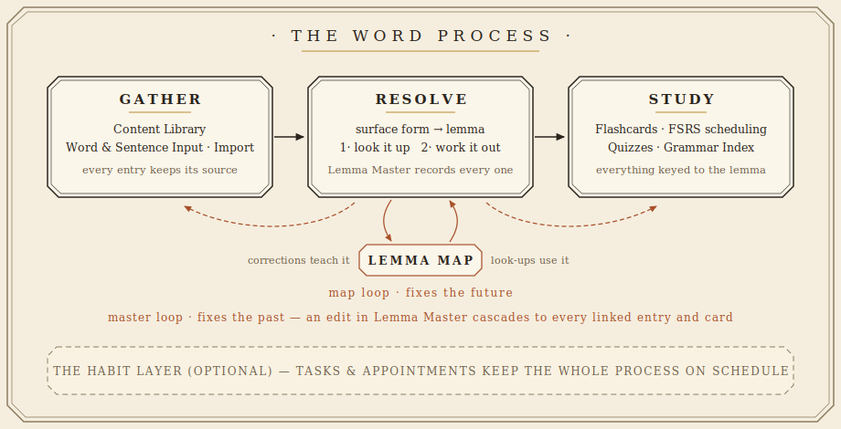

# AutoVocaIndex

AutoVocaIndex (AVI) is a self-hosted companion for language study that ties every word you meet — in any form, from any source — back to a single dictionary entry, then keeps your definitions, flashcards, and quizzes in step with that entry automatically. You deploy your own copy on free tiers, your data stays yours, and the system gets sharper the more you use it. It was built for Korean and can be converted to another language.

## The Problem and the Solution

Encountering variations of the same word (different conjugations due to tense, sentence connectors, politeness level, what have you) from different sources almost inevitably causes confusion.

"Where have I seen that word before?"

"Are '먹는데' and '먹고' related or just similar-looking?"

"I know this word was in a different deck— which one?"

"Wait, this word has another meaning?"

"Why do I have three cards with slightly different definitions for the same word?"

It's annoying and time-consuming having to comb back through all your flashcards when you need to add or update something, and you don't need a different card for every conjugation anyway.

You need one index that keeps track of everything and that ties every variation, no matter where you found it, back to a single lemma (the dictionary form, the headword you look up). And updating that lemma updates it everywhere you've seen it: all your decks stay in step. This is AutoVocaIndex — AVI for short.

The lemma is the central component. As you collect words from your studies, resolve each one to its lemma, and everything downstream— definitions, flashcards, quizzes— uses that single, consistent entry.

## What this is

AVI is a template for a web app, not an app itself. You don't make an account with AVI— you deploy your own copy and it's yours, not linked to anyone else's or even back to the template. You are welcome to change anything in it. It is designed to run on free tiers of Firebase and Netlify after setup; the only things that cost money are optional (see below).

If you have ever lost track of a flashcard, ended up with multiple for the same word, or got annoyed with the slog of creating and updating cards, this is for you. You'll need to follow a setup guide to get it running but it does not assume you can code— for any parts you want to customize, you can pop everything in your preferred AI and have it help you (there's a guide for that, too). A demo exists here [link to be added when demo site is live].

## Word Process

The figure above is the whole system in miniature. A word is *gathered*, *resolved* to its lemma, and then *studied.* (The task layer is optional but could be used to help keep your studies on schedule without leaving the app.)

### Gather

Catalogue your study material in the **Content Library**: all the novels, dramas, textbooks, etc, you are consuming for language input. When you see a new word or a sentence you want to study, drop it into the index— **Word Input** or **Sentence Input**— the moment you see it. If you already have a word list or deck(s), **Import** supports multiple file types. Each word and sentence you add gets tagged with the source title, so every entry carries its provenance and you can always trace a word back to where you encountered it. (And you get stats for words/sentences per source!) As you work through a source, you can attach notes, log open questions to return to later, and record practice sentences (and their corrections).

### Resolve

Every surface form (variation of the word) you enter is resolved to a lemma through a multi-step system. You shouldn't have to worry too much about de-conjugating unfamiliar words yourself— the system is designed to do that for you in large part.

When you enter a staged word, AVI:

1. **Looks it up.** The lemma map is a surface-form-to-lemma lookup. The template ships seeded with a large number of common forms, and it grows and improves every time you resolve something new. (For example: You enter 훌륭한 and AVI checks the map to find the 훌륭한→훌륭하다 pair. Then it fetches the dictionary definition for 훌륭하다.)

2. **Works it out.** If the exact form isn't in the map yet, AVI strips Korean verb and adjective endings to lemmatize the word into a dictionary form and gives you the most likely candidate. Confirming or fixing the surface→lemma pair then feeds the look-up for the next encounter.

**Lemma Master** is the record of every resolution— every new lemma gets one row, with its definitions, its variants, and everything linked to it.

### Corrections in Two Directions

The **map loop** (teaches AVI): Either way a word resolves, you can fix a mal-formed lemma during an import or in a Word Input row → that surface→lemma pair is written to the global map → the next time that form appears anywhere, it resolves correctly, automatically. (For example: 훌륭한 wasn't there when you entered it and you adjust the resolved lemma to 훌륭하다. Now that pair will always match for subsequent entries.) This is forward-looking: it fixes the future.

The **master loop** (keeps everything in step): You edit a lemma or a definition in Lemma Master → it cascades to every word entry, sentence entry, and flashcard linked to that lemma. This is backward-looking: it fixes the past, everywhere at once.

The map loop is what makes AVI sharper the more you use it, the master loop is what makes it convenient. The map belongs to your deployment of AVI (just like the rest of the template, you build it and use it yourself; it is not shared). If you set your deployment up with multiple users in mind (to share with a study group or family members), they can share the map and help improve it over time, too.

Definitions come from KRDict by default (English, Korean, or bi-lingual; setting up the free API key for this is explained in the guide). Use these auto-fetched definitions as a reference for your own targeted definition (the one you'll study on flashcards/in quizzes). If you prefer a different dictionary, you can adjust the template accordingly. You could also optionally wire the dictionary fetch up to an AI (just be aware you'll need your own API key for whichever model you choose and this will incur a cost per API call— KRDict is a free and reliable resource).

### Study

Once a word is an entry, it surfaces across multiple areas.

**AVI's Source tab** holds the record of every word and sentence entry per source, broken down by section.

**Flashcards** is an FSRS scheduler with which to review what you've added to AVI. Cards are automatically separated into decks based on source title and there are virtual collections that group cards based on type (all word cards, all sentence cards, everything). The daily pipeline also watches the schedule for you: if you've been away, overdue cards are triaged so the backlog doesn't bury you, and a forecast looks a week ahead and warns you about upcoming heavy review days before they arrive. A separate Grammar Deck (see Grammar Index below) is also included to assist in independently scheduled, non-FSRS review; you can also freely pick and choose one or more topics for a low-stress refresher. Text-to-Speech (TTS) is an optional addition that could incur a cost.

**Quizzes** test recall in a variety of formats within three categories: vocabulary, cloze (fill-in-the-blank), and grammar, each with configurable settings. Grammar quizzes rely on an API call (they require an API key for use and incur a cost per quiz).

**Grammar Index** is an optional way to document patterns. Entries include areas to add the explanation/usage rules and example sentences (which can be optionally hooked up to TTS), and each can be linked to similar grammar points, questions you need answers to, your practice writing, and sources/sections where you've noticed the pattern. This index feeds the Grammar Deck in Flashcards for targeted review and forms the basis for grammar quizzes.

#### The Habit Layer

Tasks and appointments wrap all of the above in a schedule: you can set a daily review to clear, a lesson on the calendar, an exam date to work toward, etc. The Content Library holds your material, AVI records new words, Flashcards and Quizzes allow you to review, and the Agenda helps you schedule it all to stay on track.

## Making it Yours

This template is the AVI base kit: you build it yourself (use the guide or pop everything in your AI of choice and ask it to help you) and can customize it to suit your specific needs and preferences.

This was built for studying Korean, so the dictionary and the de-conjugation heuristics are Korean-specific. Swap those two pieces and the rest of the structure still works.

## Technical Bits and Costs

It's built against Firebase and Netlify, and that's what the guides assume. The front end is a plain Vite build, so it will deploy to any static host; the four serverless functions are small and would port to another platform with modest effort. Firestore is a deeper root— it's called directly throughout the app rather than behind a data-access layer, so moving to a different database means rewriting that layer, not just changing a setting.

- **Firebase and Netlify** — free tiers\*. AVI is sized to fit inside them for a single learner.
- **KRDict** — free, but you register for an API key.
- **AI definitions** — optional. Your own API key, and a cost per lookup.
- **AI grammar quizzes** — same. The other two quiz types don't need a key.
- **Text-to-speech** — optional. Google Cloud TTS; free tier, then paid, and audio is cached so you don't pay twice for the same word or sentence.

\*Seeding the lemma map is a one-time process that will exceed the free Firestore tier (total cost is around $2). It is optional but recommended to use the seed data as it assists with lemma resolution even before your own entries are added. It is possible to add seed data in batches to stay within the free tier, though at the seed's size that takes weeks — the guide covers both routes.

The setup guide walks through each one. Nothing paid is on by default.

## Where to go next

For how the modules are wired together, see the [architecture guide (02)](02-architecture.md); for the Firestore collections behind them, the [data model (03)](03-data-model.md); for limitations, obstacles, and settled decisions, [decisions and gotchas (06)](06-decisions-and-gotchas.md). To fire up your own copy, start with [setup (04)](04-setup.md) and finish with [deployment (05)](05-deployment.md). And for making it yours: [building with AI (07)](07-building-with-ai.md), [converting to another language (08)](08-converting-to-another-language.md), and [customizing themes (09)](09-customizing-themes.md).

If you like what I've done here, consider finding me on [Ko-fi](https://ko-fi.com/autovocaindex). (The template is and will always be free— support is greatly appreciated but absolutely not required.)
