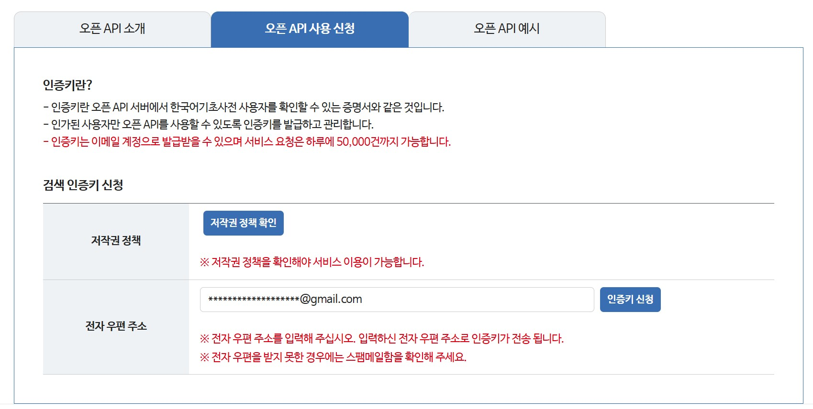
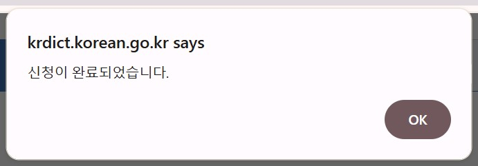
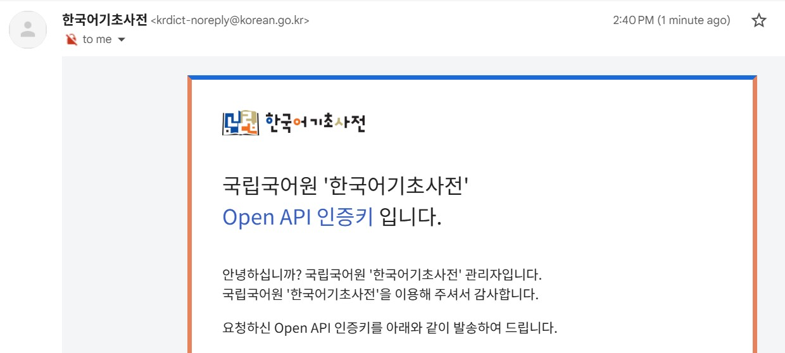

# Setup

This guide takes you from nothing to a working copy of AVI running on your own machine, signed into your own Firebase project, with your data in your own database. It does not assume you can code — every step is a console click or a command to paste. The companion [deployment guide (05)](05-deployment.md) then puts your copy on the web; do this guide first.

One warning outranks everything else here, so it goes at the top: if you import the lemma map seed (step 7), the import **must preserve the seed's `updatedAt` values verbatim**. The shipped script does this automatically and refuses to run if anything looks wrong — use it, and never "clean up" or re-stamp the seed file. The reason lives in the [decisions-and-gotchas guide (06)](06-decisions-and-gotchas.md).

---

## What you need

- A Google account (for Firebase).
- **Node.js 20 or newer** — download from nodejs.org (the LTS build is fine). This also installs `npm`.
- **Git**, if you plan to deploy via GitHub later (recommended; the deployment guide assumes it).
- About an hour, most of it waiting for consoles to load.

Everything in the required path runs on free tiers. The optional integrations (steps 6, 8, 9) each note their own cost story.

## Step 1 — Get the code

Get a copy of the repository onto your machine: on the template's GitHub page, use **Use this template** (or fork it) to create your own repository, then clone that — or just download the ZIP and extract it if you'd rather not touch Git yet. Open a terminal in the project folder and install the dependencies:

```
npm install
```

## Step 2 — Create the Firebase project

Firebase provides sign-in and the database. At [console.firebase.google.com](https://console.firebase.google.com):

1. **Create a project.** Name it anything; Google Analytics can stay off.
2. **Enable Google sign-in.** Build → Authentication → Get started → Sign-in method → **Google** → Enable (it will ask for a support email — yours).
3. **Create the database.** Build → Firestore Database → Create database → **production mode** → pick a region near you. The region is permanent, so pick deliberately; everything else about the database can change later.
4. **Register a web app.** Project settings (the gear) → General → Your apps → the `</>` (Web) icon. Name it, skip hosting, and you'll be shown an `firebaseConfig` block with six values — `apiKey`, `authDomain`, `projectId`, `storageBucket`, `messagingSenderId`, `appId`. Keep this page open for the next step.

## Step 3 — Configure the environment

Copy `.env.example` to `.env` in the project root and fill in the six `VITE_FIREBASE_*` lines from the config block you just generated. That's the whole required configuration — the optional keys further down the file stay commented out until their steps below, and the demo block at the bottom stays exactly as shipped (`VITE_DEMO_MODE=false`).

`.env` is gitignored and must never be committed. The `VITE_FIREBASE_*` values themselves are public by design — Firebase web config is not a secret — but the file will also hold real secrets once you add the optional keys, so treat it as private from the start.

## Step 4 — Deploy the rules and indexes

The security rules are what make your database *yours* — until they're deployed, Firestore's production-mode default denies everything and the app can't read or write. The repo ships `firestore.rules`, `firestore.indexes.json`, and the `firebase.json` that wires them up; deploying is three commands:

```
npm install -g firebase-tools
firebase login
firebase deploy --only firestore --project YOUR-PROJECT-ID
```

`YOUR-PROJECT-ID` is the `projectId` from your config block. The `--project` flag is required every time: the template deliberately ships no `.firebaserc`, so no one's project id is baked into the code.

Don't be alarmed that `firestore.indexes.json` is empty — that's its correct state. No query in the app needs a composite index; the file exists so the deploy command works and so a future index has a home (details in the data model guide).

## Step 5 — Run it

Local development runs through the Netlify CLI, which wraps the Vite dev server, serves the serverless functions, and injects your `.env`:

```
npm install -g netlify-cli
netlify dev
```

Open the port the CLI prints (usually `http://localhost:8888`) — that's the wrapper, with the functions and redirects live. The raw Vite port it proxies serves none of that, so every dictionary/AI/TTS call would 404 there. Plain `vite dev` has the same problem; always `netlify dev`.

Two things worth knowing about that startup output. First, the line beginning **"Injected .env file env vars:"** lists exactly which variables were loaded — it's the fastest way to audit your environment when something isn't working. Second, once this folder is *linked* to a Netlify site (which happens in the deployment guide), `netlify dev` also injects the linked site's variables, so the values you're running with may no longer be only the ones in your `.env` — when in doubt, read the injection lines to see where each variable came from.

Sign in with Google. You should land on an empty Today page with the full navigation — no data yet, no errors. Add a task and reload to confirm the database round-trip works. The app is now fully functional for everything that doesn't need an external key: content library, word and sentence input (with the offline resolution heuristics), lemma master, flashcards, vocabulary and cloze quizzes, the grammar index, tasks, and appointments.

## Step 6 — The KRDict key (recommended, free)

KRDict is the default dictionary behind the reference-definition fetch. The key is free; registration takes a minute:

1. Go to [krdict.korean.go.kr/kor/openApi/openApiRegister](https://krdict.korean.go.kr/kor/openApi/openApiRegister).
2. Click the **저작권 정책** button in the table to open the terms. At the bottom, check the box next to **저작권 정책을 확인하였으며 동의합니다. (필수)** and click **확인** to confirm and close.
3. Enter your email address and click **인증키 신청** to register.



A popup confirms the request went through:



Check your email for the confirmation message containing your API key (인증키):



Uncomment `KRDICT_API_KEY=` in `.env`, paste the key, restart `netlify dev`, and fetch a definition for any word to confirm. One trap to know about: an invalid or expired key does **not** produce a visible error — KRDict returns error XML with a normal HTTP 200. If every lookup comes back "Definition not found.", check the function logs in the `netlify dev` terminal: a healthy response logs on the order of 17,000 characters, an error response around 400.

## Step 7 — Seed the lemma map (optional, recommended)

The shipped seed (`seed/globalLemmaMap.json`) pre-loads the lemma map with over a million common surface→lemma pairs, so resolution works well from your very first entry instead of only after months of corrections. Importing it uses the Admin SDK, which needs a service-account key:

1. In the Firebase console: Project settings → **Service accounts** → **Generate new private key**. A JSON file downloads.
2. **Save that file outside the project folder.** Its downloaded filename does not match the repo's ignore patterns, so saving it inside the working directory risks committing a credential. Anywhere else on disk is fine.
3. From the project root:

```
node seed/import-lemma-map.js C:\path\to\your-service-account.json
```

The script prints the row count, writes in safe batches, refuses to run if any row's `updatedAt` isn't already a string (the verbatim guarantee), and finishes with an automatic spot-check that reads one pre-cutoff row back from your project and compares it against the file. It's safe to re-run — writes overwrite in place.

**The cost note.** Firestore's free (Spark) tier allows 20,000 document writes per day, and the import performs one write per seed row — and the seed is over a million rows, so the free quota can't cover it in any practical way (splitting the JSON into under-quota chunks and running one per day is possible, but takes weeks). The route this template's own deployment used: temporarily upgrade the project to the **Blaze** plan, run the import — the one-time cost is around $2 — and downgrade back to Spark immediately after. Import first, *then* downgrade, in that order. Blaze has no fixed fee; you pay only for the writes themselves.

## Step 8 — AI features (optional, paid)

An Anthropic API key enables two features: AI-generated reference definitions (the `api` dictionary mode in Settings) and grammar quizzes. Get a key at [console.anthropic.com](https://console.anthropic.com), uncomment `ANTHROPIC_API_KEY=` in `.env`, and restart. Each definition lookup and each grammar quiz is one API call, billed to your key; the serverless functions pin the model and cap the tokens, so per-call cost is small and bounded.

One quirk to expect: the Settings page also has an "Anthropic API key" field. That field only switches the grammar-quiz UI on — the functions authenticate with the `ANTHROPIC_API_KEY` environment variable, never with the value typed in Settings. Both need to be present for grammar quizzes: the env var to do the work, the Settings field to unlock the button.

## Step 9 — Text-to-speech (optional, paid past the free allowance)

TTS audio comes from Google Cloud Text-to-Speech, cached in a Cloud Storage bucket so no clip is ever paid for twice. Your Firebase project *is* a Google Cloud project, so you provision inside the same project at [console.cloud.google.com](https://console.cloud.google.com) (select it in the project picker):

1. **Enable the API.** APIs & Services → Library → search "Cloud Text-to-Speech API" → Enable. This requires a billing account on the project; the free monthly allowance (a substantial number of WaveNet characters) still applies, and single-learner usage typically stays inside it.
2. **Create the bucket.** Cloud Storage → Buckets → Create. Name it (globally unique), pick the same region as your Firestore. After creation, grant public read on its objects: the bucket's Permissions tab → Grant access → principal `allUsers`, role **Storage Object Viewer**. The app plays audio through public `storage.googleapis.com` URLs, so this is required — the bucket will only ever contain generated audio clips.
3. **Create a service account.** IAM & Admin → Service Accounts → Create. Grant it the **Storage Object Admin** role (scoped to the bucket if you prefer). Then open the account → Keys → Add key → JSON; a key file downloads — same handling rule as step 7: keep it outside the project folder.
4. **Fill the env block.** Uncomment the five `GCP_*` lines in `.env` and copy the values from the key file: `project_id`, `client_email`, `private_key_id`, and `private_key` map to their obvious variables, and `GCP_TTS_BUCKET` is your bucket name. `GCP_PRIVATE_KEY` must be **one line, with literal `\n` sequences in place of newlines — exactly as it appears inside the JSON file**; copy it verbatim, quotes' contents only. (The credentials are split across variables instead of pasted as one JSON blob because the full file exceeds the 4 KB per-variable limit on serverless platforms — the gotchas guide has the entry.)

Restart, enable TTS in Settings, and create a card — audio should attach a moment later.

## Where to go next

Your copy works, but it's tied to this machine. The point of the web deployment is that it stops being tied to any one device: the [deployment guide (05)](05-deployment.md) puts your copy on Netlify so every device you use — desktop, laptop, tablet, phone — signs into the same database and stays in sync, and it covers the environment-variable ordering trap that can make a first deploy fail silently.
